# Traano — Personal Finance Anomaly & Behavioral Intelligence Platform

## One-Line Description
Traano is an AI-powered web application that analyzes bank statements, automatically categorizes transactions, and detects unusual financial behavior using statistical anomaly detection and Gemini-generated explainable insights.

---

# 1. Problem Statement

## Problem Title
Absence of Intelligent Monitoring and Explainable Insights in Personal Digital Finance

## Problem Description
Today's users perform most of their financial activity through UPI, credit cards, and online banking, generating hundreds of transactions each month. While banks provide downloadable statements, they present only raw records and basic summaries without meaningful interpretation.

As a result, unusual activity such as fraudulent charges, duplicate payments, unfamiliar merchants, or sudden spending spikes often goes unnoticed. Users have access to financial data but lack tools that automatically analyze spending behavior and proactively highlight irregularities in a simple and understandable way.

---

## Target Users

- College students managing monthly allowances or stipends  
- Working professionals using UPI and credit cards regularly  
- Individuals tracking recurring subscriptions and auto-debits  
- Users concerned about fraudulent or unauthorized transactions  
- First-time personal finance users seeking financial awareness  
- Anyone who downloads bank statements but never meaningfully analyzes them  

---

## Existing Gaps

1. Banks provide records, not intelligence  
2. Reactive fraud awareness  
3. Manual expense categorization  
4. No behavioral analysis tools  
5. Lack of explainable alerts  
6. Unstructured financial data  

---

# 2. Use Case Diagram

## Actors
- User  
- Admin  
- Gemini API (External AI Service)  
- Anomaly Detection Service (Python Service)  

## Use Case Diagram

```mermaid
graph TD
    subgraph Actors
        User(["👤 User"])
        Admin(["🔧 Admin"])
        Gemini(["🤖 Gemini API"])
        Anomaly(["📊 Anomaly Detection Service"])
    end

    subgraph User Actions
        Register["Register"]
        Login["Login"]
        Upload["Upload Bank Statement"]
        Dashboard["View Dashboard"]
        Transactions["View Transactions"]
        Alerts["View Anomaly Alerts"]
        Summary["View Financial Summary"]
        Report["Download Report"]
    end

    subgraph Processing
        Extract["Extract Transactions"]
        Normalize["Normalize Data"]
        Categorize["Categorize Merchant"]
        Analyze["Analyze Transactions"]
        Score["Calculate Anomaly Score"]
        Shift["Detect Behavioral Shift"]
        Explain["Generate Explanation"]
    end

    subgraph Admin Actions
        ManageUsers["Manage Users"]
        MonitorLogs["Monitor Logs"]
        ManageCategories["Manage Categories"]
    end

    User --> Register
    User --> Login
    User --> Upload
    User --> Dashboard
    User --> Transactions
    User --> Alerts
    User --> Summary
    User --> Report

    Upload --> Extract
    Extract --> Normalize
    Normalize --> Categorize
    Categorize --> Gemini

    Extract --> Analyze
    Analyze --> Anomaly
    Analyze --> Score
    Analyze --> Shift
    Analyze --> Explain
    Explain --> Gemini

    Admin --> ManageUsers
    Admin --> MonitorLogs
    Admin --> ManageCategories
```

---

# 3. Proposed Solution

## Solution Overview

Traano converts raw bank statements into meaningful behavioral insights.

Users can:

- Upload CSV or PDF statements
- Automatically extract and structure transactions
- Categorize expenses using AI
- Detect unusual spending behavior
- Receive explainable anomaly alerts

## Core Idea

Shift personal finance from passive record-keeping to proactive financial awareness.

The system:

- Learns normal spending patterns
- Detects deviations
- Identifies suspicious merchants
- Generates explainable insights

## Key Features

- CSV and PDF Upload
- Automatic Data Extraction
- AI Merchant Categorization
- Statistical Anomaly Detection
- Behavioral Shift Detection
- High-Value Transaction Alerts
- Suspicious Merchant Identification
- Risk Scoring
- Spending Trend Visualization
- AI-Generated Financial Summaries

---

# 4. System Architecture

## High-Level Flow

User → Frontend → Backend → AI Processing → Database → Dashboard

## Architecture Diagram

---

# 5. Database Design

## Primary Entities

### User

- User ID
- Name
- Email
- Password

### Transaction

- Transaction ID
- User ID
- Merchant
- Amount
- Date
- Category
- Anomaly Score

### Category Insight

- Category Name
- Total Spending
- Frequency
- Trend

### Generated Insight

- Insight ID
- User ID
- Summary
- Explanation
- Timestamp

## ER Diagram

---

# 6. Dataset Selected

## Dataset Name

User Uploaded Bank Transaction Statements

## Source

User-provided bank statements (CSV and PDF formats)

## Data Fields

- Transaction Date
- Merchant Description
- Debit/Credit Amount
- Reference Information

## Preprocessing Steps

- File upload handling
- PDF text extraction
- CSV parsing
- Column normalization
- Date standardization
- Debit/Credit separation
- Merchant cleaning
- Duplicate removal
- Structured formatting

---

# 7. Model Selected

## Model Name

Hybrid Statistical Anomaly Detection + AI Reasoning (Gemini API)

## Why This Model?

- No labeled personal fraud dataset available
- Behavioral deviation detection is practical
- Low computational cost
- Provides explainability

## Techniques Used

- Z-Score Outlier Detection
- Frequency Deviation Analysis
- Merchant Novelty Detection
- Spending Pattern Shift Detection

## Evaluation Metrics

- Outlier Score
- False Positive Rate
- Behavioral Change Detection
- Alert Explainability

---

# 8. Technology Stack

## Frontend

- React (Vite)
- Tailwind CSS
- Recharts
- Axios

## Backend

- Node.js
- Express.js
- Multer
- PDF-Parse
- CSV-Parser

## AI / ML

- Python (FastAPI)
- Pandas
- NumPy
- Scikit-learn
- Google Gemini API

## Database

- MongoDB Atlas
- Mongoose ODM

## Deployment

- Frontend: Vercel / Netlify
- Backend: Render / Railway
- Python Service: Render
- Database: MongoDB Atlas

---

# 9. Future Enhancements

- Real-time bank API integration
- Mobile application version
- Personalized budgeting suggestions
- Predictive expense forecasting
- Multi-bank account linking
- Advanced ML-based fraud detection

---

## Developed By

Traano Team

## License

This project is developed for academic and research purposes.